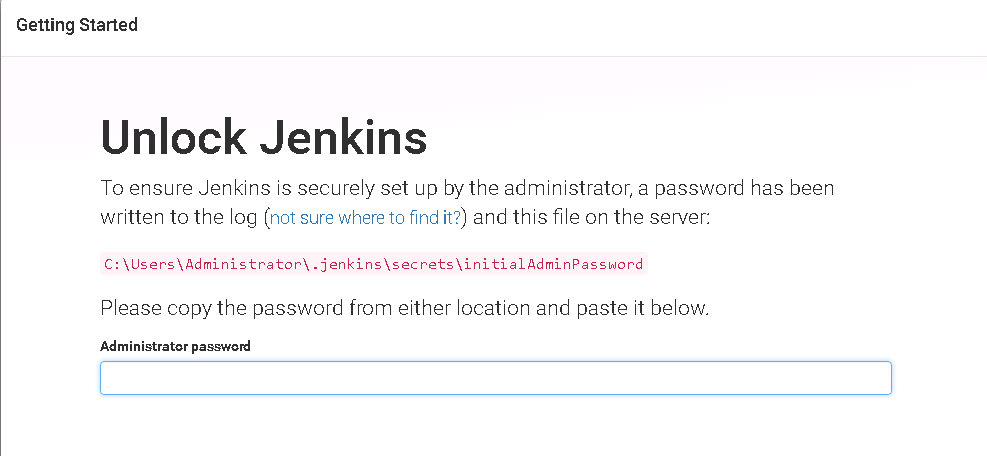

## docker安装jenkins.md
### 安装Jenkins
通过docker拉取Jenkins镜像
```code
 // 拉取镜像
 docker pull jenkinsci/blueocean
 
 // 查看镜像
 docker images
 
 //创建容器
 docker run  -d -p 8080:8080  --name myjenkins    -v /root/jenkins-home:/root/jenkins_home  jenkinsci/blueocean 
 
 // 浏览器打开jenkins
 http://localhost:8080
```

### Jenkins配置
#### 解锁Jenkins

```code
// 进入jenkins容器
docker exec -it [container ID] sh
// 获取初始密码
cat /var/jenkins_home/secrets/initialAdminPassword

输入后即使jenkins的初始化配置
```
#### 创建用户

###  Jenkins配置
### 参考
* https://ci.jenkins.io/
* https://cloud.tencent.com/developer/article/1379404
